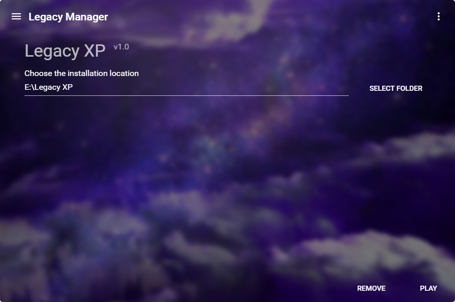
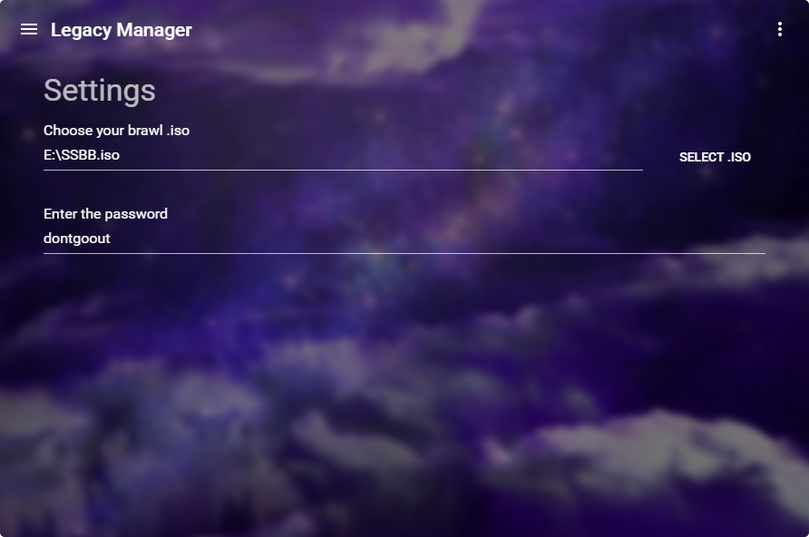

# Legacy Manager
This is a mod manager for Super Smash Bros. Brawl Legacy XP.
Its purpose os to be a one-click installer/launcher for everything SmashBrosLegacy related.

## Installation
If you just want a working version and do not want to tamper with any source code, just download the official client from this link (link coming soon).

## Screenshots
|              Legacy XP Installation              |                     Settings                     |
| ------------------------------------------------ | ------------------------------------------------ |
|   |   |

## Current features
- Selectable installation folder for Legacy XP
- Selectable SuperSmashBrosBrawl.iso location
- Clicking [Install] automatically downloads the mod files and builds the game
- Clicking [Remove] automatically removes the game (but not the Legacy Manager)

## Feature requests
There are already many features planned, but if you have an interesting idea or just a feature you'd like to see implemented, just send me an [e-mail](mailto:ciriousjoker@gmail.com) or open up an issue.

This thing is NOT READY FOR RELEASE and is under development. Check back to see when it's finished or make pull requests in order to speed things up :)

## How to use this repository
See [this](USAGE.md) document for information on how this repository is structured and how to build.

## Legal

This sourcecode is licensed under the [MIT license](LICENSE).